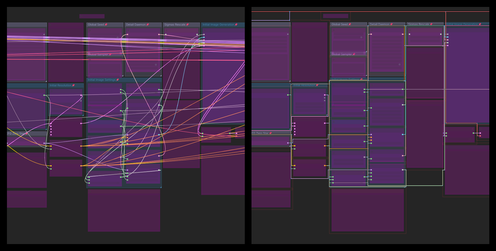

# ComfyUI-LinkRouter

<a href="https://www.buymeacoffee.com/90red" target="_blank">
  
</a>

> **I'm new to all this — first plugin, first GitHub repo, learning as I go.**
> If you find bugs, have ideas, or just want to help a beginner out, I'd be incredibly grateful. 
> Bug reports, PRs, suggestions, or just [buying me a coffee](https://buymeacoffee.com/90red) ☕ — every bit of support honestly makes my day. Thank you! 🙏

---

**Object-avoiding orthogonal link routing for ComfyUI.** Links automatically detour around nodes with smooth right-angle paths — no more spaghetti lines.



## Features

Links automatically route around nodes instead of through them. Animated flow markers on hover or selection. Floating bar for quick toggles.

## Installation

```bash
cd ComfyUI/custom_nodes/
git clone https://github.com/90-RED/ComfyUI-LinkRouter
```
Then reload ComfyUI with `Ctrl+R`.

## Usage

LinkRouter is enabled by default. A floating bar appears on the right:

| 🔀 | Toggle routing |
| 🌊📐➖ | Cycle official link styles |
| ✨➤◾ | Cycle flow markers (animated/static/none) |

All visual parameters are in **Settings → LinkRouter**.

## Credits

- **Algorithm**: Wybrow, Marriott, Stuckey — *"Orthogonal Connector Routing"* (Graph Drawing 2009)
- **Incremental routing**: Wybrow et al. — *"Incremental Connector Routing"* (GD 2005)
- **Inspiration**: libavoid (Adaptagrams), react-flow-smart-edge, JointJS
- All code is original JavaScript — no third-party dependencies

## License

Apache-2.0 — see [LICENSE](LICENSE).
